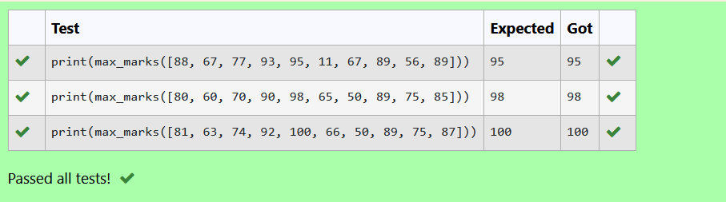

# Find the maximum of a list of numbers
## Aim:
To write a program to find the maximum of a list of numbers.
## Equipment’s required:
1.	Hardware – PCs
2.	Anaconda – Python 3.7 Installation / Moodle-Code Runner
## Algorithm:
1.	Get the list of marks as input
2.	Use the sort() function or max() function or use the for loop to find the maximum mark.
3.	Return the maximum value
## Program:

i)	# To find the maximum of marks using the list method sort.
```Python
#Developed by:KAVINESH M
#Register no:22008476
def max_marks(marks):
    return max(marks)


```

ii)	# To find the maximum marks using the list method max().
```Python
#Developed by:KAVINESH M
#Register no:22008476
def max_marks(marks):
    return max(marks)


```

iii) # To find the maximum marks without using builtin functions.
```Python
#Developed by:KAVINESH M
#Register no:22008476
def max_marks(list1):
    return max(list1)


```
## Sample Input and Output
 


## Output:


## Result:
Thus the program to find the maximum of given numbers from the list is written and verified using python programming.
